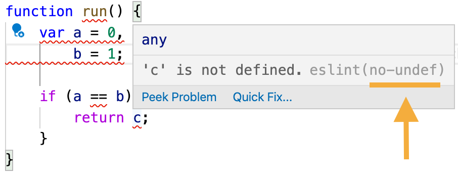

1. Установите LTS (Latest) версию `nodejs` (https://nodejs.org/en/)

2. В терминале перейдите в корневую папку проекта

3. Вызовите команду `npm init -y`. Эта команда создаст файл `package.json`

4. Дальше установите необходимые пакеты командой `npm install eslint babel-eslint eslint-config-airbnb-base eslint-config-prettier eslint-plugin-import`

3. Добавьте файл с названием `.eslintrc.js` в корневую папку проекта с содержимым
```
module.exports = {
    extends: ['airbnb-base', 'prettier'],
    parser: 'babel-eslint',
    env: {
        browser: true,
        es6: true,
        jest: true,
    },
    rules: {
        'no-console': 0,
        'import/prefer-default-export': 0,
    },
};
``` 
4. Установите [плагин для VSCode](https://marketplace.visualstudio.com/items?itemName=dbaeumer.vscode-eslint) 

5. Перезагрузите VSCode

6. Теперь в редакторе будут подчеркиваться красным синтаксические ошибки в коде. Так же будут подчеркиваться те части кода, которые написаны не лучшим образом и могут привести к ошибкам

7. Чтобы убедиться, что все сработало, вставьте следующий кусок в любой `.js` файл. В этой ф-ции плохо все и все должно подсвечиваться красным
```
function run() {
    var a = 0,
        b = 1;

    if (a == b) {
        return c;
    }
}
```



8. Когда какой-то участок кода подсвечивается красным - это означает, что вы написали его не лучшим образом. Лучше сразу исправить. Чтобы понять, как исправить, наведите на красный код курсор мыши. Появится popup с информацией об ошибке и ее
идентификатор (на картинке подчеркнут линией `eslint(no-undef)`). В Google ищите `eslint no-undef`. Вы попадете на сайт с документацией по ESLint. Там будет достаточно подсказок